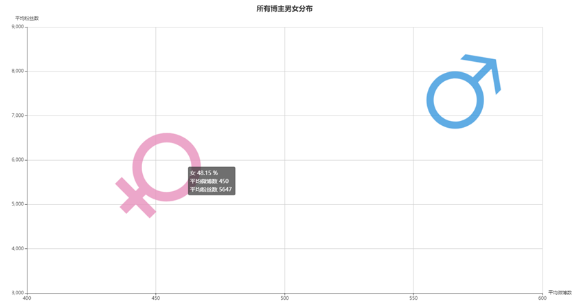
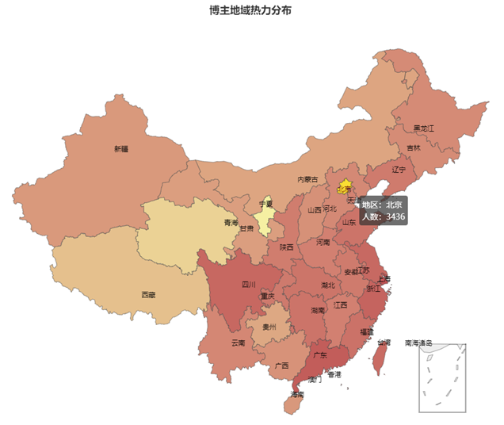
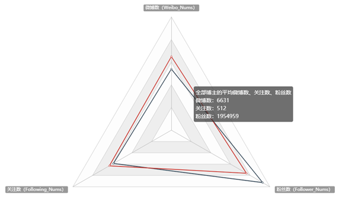
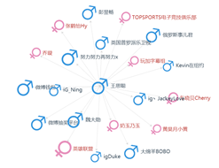
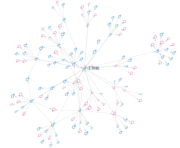
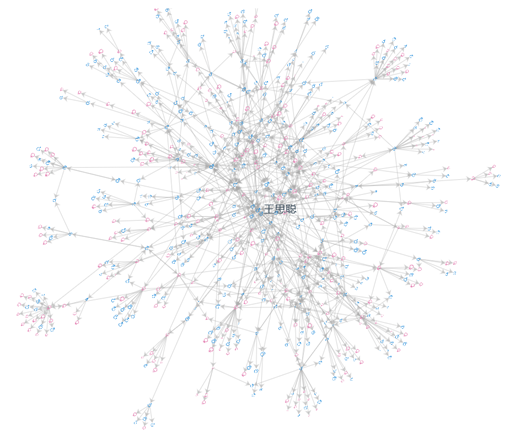
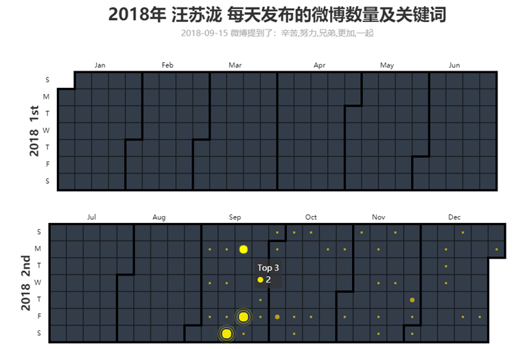
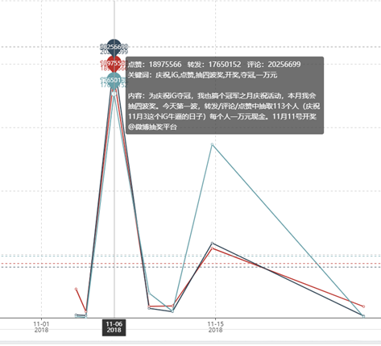
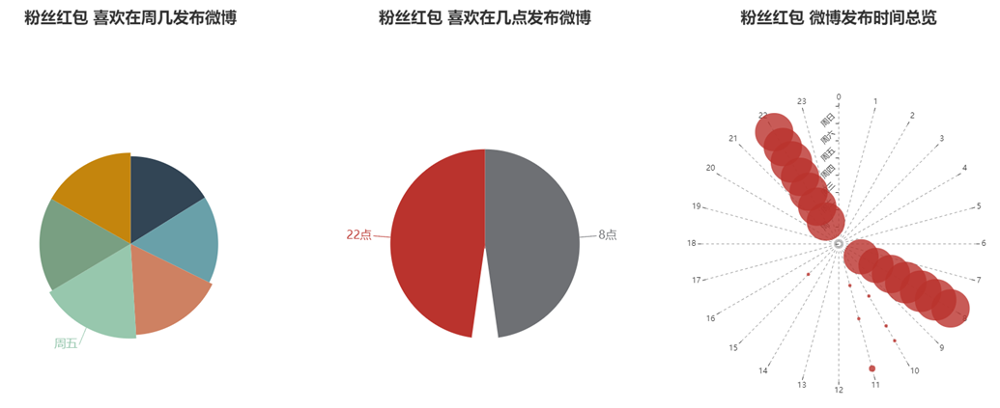

# 微博数据可视化开发文档
## 开发
```shell
cnpm install
npm start
```

## 功能模块

### 宏观维度
#### 博主男女分布图

**分析维度**：全部博主的男女对比

**分析方式**：散点图

**分析内容**：

1. 男女的占比；
2. 男女的平均微博数对比； 
3. 男女的平均粉丝数对比



#### 博主地理位置分布热力图

**分析维度**：全部博主地域分布

**分析方式**：地图

**分析内容**：

1. 微博使用人数在全国的分布情况，普遍在东部颜色较深；  
2. 各省微博使用的人数




### 博主个人维度
#### 粉丝数、关注数和微博数

分析维度：微博数、关注数、粉丝数

分析方式：雷达图

分析内容：比较 **全部博主的平均数** 与 **特定博主** 的情况



#### 朋友关系拓扑图

**分析维度**：好友圈、好友拓扑

**分析方式**：关系图

**分析内容**：

1. 博主的直接、间接好友的朋友有哪些人

2. 博主的好友中男女分布





#### 微博数日历图

**分析维度**：微博打卡情况

**分析方式**：日历图

**分析内容**：

1. 挖掘特定博主在一年内的微博发布情况

2. 日历图单元格内的点越大，表示当天微博数量越多

3. 点击后还能看到当天所有微博出现的高频、关键词



#### 微博热度折线图

**分析维度**：微博热度趋势

**分析方式**：折线图

**分析内容**：

1.  博主微博的点赞、评论、转发数量的变化趋势；  

2. 每条微博的内容



#### 微博词云图

**分析维度**：微博常用词

**分析方式**：词云图

**分析内容**：

1. 博主的常用词分布，大小表示频度

2. 博主的关注领域


#### 微博发布时间分布图

**分析维度**：微博发布时间

**分析方式**：饼图、散点图

**分析内容**：

1. 博主在周几的发布频率
2. 博主在几点的发布频率
3. 博主在周几的几点发布频率




## 代码结构

### 前端代码结构

```
./src
├── assets # 图片素材
│   ├── boy.png
│   ├── girl.png
├── global.css # 全局css
├── layouts
│   ├── index.css # 整部布局css
│   └── index.js # 整体布局
├── menuConfig.js # 左侧菜单配置
├── models # Dva Models
│   └── blogger.js # blogger数据的Dva Model
├── pages # 存取各个页面
│   ├── BloggerDistribution 
│   │   └── index.js # 博主男女分布可视化
│   ├── bloggers
│   │   ├── Components
│   │   │   ├── BasicInfo.js # 粉丝数、关注数、信息可视化
│   │   │   ├── FriendsTopology.js # 朋友关系拓扑图
│   │   │   ├── PopularityTrend.js # 热度趋势折现图
│   │   │   ├── WeiboCalendar.js # 微博发布日历
│   │   │   ├── WeiboPublishTime.js # 微博发布时间
│   │   │   └── WeiboWordCloud.js # 词云图
│   │   └── $name.js # 博主详情页
│   ├── HeatMap
│   │   └── index.js # 博主地理位置热力图
│   ├── index.css # 首页css样式
│   └── index.js # 首页（博主列表）
├── services
│   └── bloggerService.js # 后端数据接口
└── utils
    ├── config.js # 项目配置
    └── request.js # 数据请求功能的封装
```

### 服务端代码结构

```
./server
├── index.js # 程序入口
├── lib
│   ├── mongo.js # 连接mongodb
│   └── utils.js # 工具函数
├── models
│   ├── bloggerFriend.js # 博主朋友关系Model
│   ├── blogger.js # 博主Model
│   ├── weiboContent.js # 微博内容Model
└── routers
    ├── bloggers.js # 博主路由
    └── statistic.js # 统计数据路由
```

## 服务端API文档

### 获取博主列表

路由：GET /api/bloggers

请求参数：

- page：第几页 
- limit：每页几个 
- name：博主姓名模糊搜索

返回数据：

```json
[
    {
        "_id": "5c2f2381e5286e5170d6fa9d",
        "id": "5878659096",
        "name": "超话社区",
        "sex": "男",
        "birthplace": "北京",
        "weibo_num": 2500,
        "following": 1044,
        "followers": 75880204
    }
]
```

### 获取博主数量

路由：GET /api/bloggers/count

请求参数：

- name：博主姓名模糊搜索

返回数据：

```json
{
    "count": 10500
}
```

### 获取单个博主基本信息

路由：GET /api/bloggers/:id

请求参数：

- id：博主id

返回数据：

```json
{
    "_id": "5c2f2381e5286e5170d6fa9d",
    "id": "5878659096",
    "name": "超话社区",
    "sex": "男",
    "birthplace": "北京",
    "weibo_num": 2500,
    "following": 1044,
    "followers": 75880204
}
```

### 获取博主朋友列表

路由：GET /api/bloggers/:id/friends

请求参数：

- id：博主id

返回数据：

```json
[
    {
        "_id": "5c3830e23a0d0501b2b15f9d",
        "friend_id": {
            "_id": "5c2f5492e5286e1020d8ddf9",
            "id": "5136362277",
            "friends": [
                {
                    "_id": "5c382e0c3a0d0501b2b0e63b",
                    "friend_id": {
                        "_id": "5c327921e5286e5de011e5bc",
                        "id": "5574029246",
                        "friends": [
                            {
                                "_id": "5c3831743a0d0501b2b17fa0",
                                "friend_id": "5c36154be5286e47bc26014a",
                                "id": "6540424837",
                                "name": "种草小海龟",
                                "followers": 2707217,
                                "sex": "女",
                                "birthplace": "广东"
                            }
                        ],
                        "birthplace": "北京",
                        "followers": 2454415,
                        "name": "微博电商",
                        "sex": "男"
                    },
                    "id": "5574029246",
                    "name": "微博电商",
                    "followers": 2454415,
                    "sex": "男",
                    "birthplace": "北京"
                },
            ],
            "birthplace": "北京",
            "followers": 16449291,
            "name": "微博红包",
            "sex": "男"
        },
        "id": "5136362277",
        "name": "微博红包",
        "followers": 16449291,
        "sex": "男",
        "birthplace": "北京"
    }
]
```
### 获取博主微博列表
路由：GET /api/bloggers/:id/weiboContent

请求参数：

- id：博主id

返回数据：

```json
{
    "contents": [
        {
            "tfidf": [
                {
                    "_id": "5c3aa6c6338845026949e1a8",
                    "word": "鲁豫有约",
                    "weight": 27.801355304
                }
            ],
            "publish_content": "在@鲁豫有约 做过至少三次对话，鲁豫既有传统媒体人的责任跟态度，又能接收新鲜文化跟内容，每次都聊的很畅快#鲁豫有约18岁了#生日快乐",
            "publish_location": "无",
            "publish_time": "2019-01-05 15:01",
            "like": 438,
            "forward": 65,
            "comment": 116,
            "publish_tool": "iPhone 7"
        }
    ],
    "tfidf": [
        {
            "word": "AI",
            "weight": 1056.5283876375188
        },
        {
            "word": "偷笑",
            "weight": 503.9408293195
        },
    ]
}
```
### 获取平均粉丝数、关注数和微博数统计

路由：GET /api/statistic/average

返回数据：

```json
{
    "_id": null,
    "avg_followers": 1954959.6494285713,
    "avg_weibo_num": 6631.755142857143,
    "avg_following": 512.3624761904762,
    "max_followers": 182775632,
    "max_weibo_num": 756859,
    "max_following": 20000
}
```

### 获取性别分布统计

路由：GET /api/statistic/sex 


返回数据：

```json
[
    {
        "_id": "女",
        "value": 5056,
        "avg_followers": 1736109.3710443038,
        "avg_weibo_num": 5647.630735759493,
        "avg_following": 450.856210443038,
        "max_followers": 182775632,
        "max_weibo_num": 374663,
        "max_following": 20000,
        "name": "女"
    },
    {
        "_id": "男",
        "value": 5444,
        "avg_followers": 2158212.2224467304,
        "avg_weibo_num": 7545.73989713446,
        "avg_following": 569.4851212343865,
        "max_followers": 110417438,
        "max_weibo_num": 756859,
        "max_following": 20000,
        "name": "男"
    }
]
```

### 获取地理分布统计
路由：GET  /api/statistic/location

返回数据：

```json
[
    {
        "name": "安徽",
        "value": 93
    }
]
```